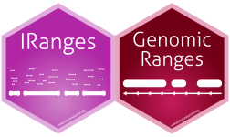

```{r setup, include=FALSE}
options(htmltools.dir.version = FALSE)
```

# Bioconductor Infrastructure is powerful...

```{r, echo=FALSE, fig.align='center'}

```


---
# but the learning curve can be steep. 

- Object oriented thinking.

- Many, many intermediate classes to keep track of.

- Method discovery.

- Return type consistency.

---
class: inverse, center, middle


## Can most genomic data wrangling tasks can be performed with just _*Ranges_?

---

# Example: restriction by fraction of overlap

### bedtools
```{bash, eval = FALSE}
bedtools intersect -a cpg.bed -b exons.bed  -g hg19 -f 0.5 -wo
```

### Bioconductor
```{r, eval = FALSE}
library(GenomicRanges)
library(rtracklayer)
cpg <- import("cpg.bed", genome = "hg19") # GRanges 
exons <- import("exons.bed", genome = "hg19") # GRanges
pairs <- findOverlapPairs(cpg, exons, ignore.strand = TRUE) # Pairs
olap <- pintersect(pairs, ignore.strand = TRUE) # GRanges
keep <- width(olap)/width(first(pairs)) >= 0.5 # logical vector
pairs <- pairs[keep] # Pairs 
mcols(pairs)$overlap_width <- width(olap)[keep] # add colum to Pairs
```

---
# plyranges approach

```{r, eval = FALSE}
library(plyranges)
cpg <- read_bed("cpg.bed",genome_info = "hg19")
exons <- read_bed("exons.bed", genome_info = "hg19" )
overlaps <- join_overlap_inner(cpg, exons) %>% 
  filter(width / width.x  >= 0.5) %>%
  mutate(overlap_width = width)
```

---

# Summary
    
_plyranges_ is:

- Declarative and functional.

- **Always** returns a Ranges object.

- Provides a grammar built on top of IRanges/GenomicRanges.

---
# Acknowledgements

* **Michael Lawrence**

* **Di Cook**

* Matt Ritchie

* Charity Law

* Earo Wang

* BiocAsia2017 organising committee

# https://github.com/sa-lee/plyranges